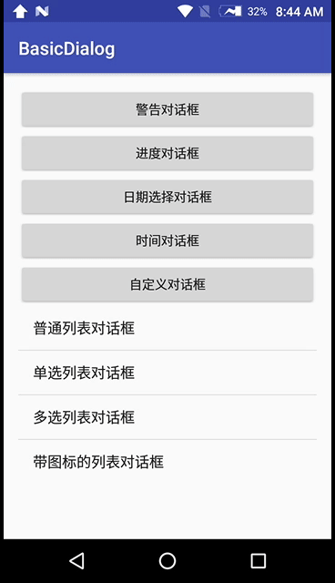

# BasicDialog

Android中对话框的展示，对人机交互有着重要的意义，常见的对话框包括：

`警告对话框`

`进度对话框`

`日期选择对话框`

`时间选择对话框`

`普通列表对话框`

`单选列表对话框`

`多选列表对话框`

`带图标的列表对话框`

对于特殊的对话框形式还可以`自定义对话框`

下面对这些对话框的使用进行说明：

**1.警告对话框**

```java
private void showAlertDialog() {
        AlertDialog.Builder builder = new AlertDialog.Builder(this);
        builder.setTitle("提示");
        builder.setIcon(R.mipmap.ic_launcher);
        builder.setMessage("您有一笔2千万的汇款在处理，请问是您亲自操作的吗？");
        builder.setPositiveButton(R.string.confirm, new DialogInterface.OnClickListener() {
            @Override
            public void onClick(DialogInterface dialogInterface, int i) {
                Log.d(TAG, "onClick: " + i);
                toast(R.string.confirm);
            }
        });
        builder.setNegativeButton(R.string.cancel, new DialogInterface.OnClickListener() {
            @Override
            public void onClick(DialogInterface dialogInterface, int i) {
                dialogInterface.dismiss();
                toast(R.string.cancel);
            }
        });
        builder.setNeutralButton(R.string.exit, new DialogInterface.OnClickListener() {
            @Override
            public void onClick(DialogInterface dialogInterface, int i) {
                Log.d(TAG, "onClick: " + i);
                toast(R.string.exit);
            }
        });
        AlertDialog dialog = builder.create();
        dialog.show();
}
```

**2.进度对话框**

```java
private void showPgsDialog() {
        final ProgressDialog dialog = new ProgressDialog(this);
        dialog.setTitle("下载提示");
        dialog.setProgressStyle(ProgressDialog.STYLE_HORIZONTAL);
        dialog.setMax(100);
        dialog.setButton(DialogInterface.BUTTON_POSITIVE, getString(R.string.background), new DialogInterface.OnClickListener() {
            @Override
            public void onClick(DialogInterface dialog, int which) {

            }
        });
        dialog.onStart();
        new Thread(new Runnable() {
            @Override
            public void run() {
                int i = 10;
                while (i <= 100) {
                    try {
                        Thread.sleep(100);
                        dialog.incrementProgressBy(1);
                        i++;
                    } catch (InterruptedException e) {
                        e.printStackTrace();
                    }
                }
                dialog.dismiss();
            }
        }).start();
        dialog.show();
}
```

**3.日期选择对话框**

```java
private void showDatePickerDialog() {
        Calendar calendar = Calendar.getInstance();
        int year = calendar.get(Calendar.YEAR);
        int month = calendar.get(Calendar.MONTH);
        int day = calendar.get(Calendar.DAY_OF_MONTH);
        DatePickerDialog dialog = new MyDatePickerDialog(this, new DatePickerDialog.OnDateSetListener() {
            @Override
            public void onDateSet(DatePicker datePicker, int year, int monthOfYear, int dayOfMonth) {
                Log.d(TAG, "onDateSet: " + year + "." + (monthOfYear + 1) + "." + dayOfMonth);
                String date = String.format(Locale.CHINESE, "%04d.%02d.%02d", year, monthOfYear + 1, dayOfMonth);
                btDate.setText(date);
            }
        }, year, month, day);
        dialog.show();
}
```

在构造DatePickerDialog的时候需要传入初始化的year,month,day，monthOfYear是从0开始的，所以得到的月份要记得加1。

**4.时间选择对话框**

```java
private void showTimePickerDialog() {
        Calendar calendar = Calendar.getInstance();
        int hour = calendar.get(Calendar.HOUR_OF_DAY);
        int minute = calendar.get(Calendar.MINUTE);
        TimePickerDialog dialog = new MyTimePickerDialog(this, new TimePickerDialog.OnTimeSetListener() {
            @Override
            public void onTimeSet(TimePicker timePicker, int hourOfDay, int minute) {
                Log.d(TAG, "onTimeSet: " + hourOfDay + ":" + minute);
                String time = String.format(Locale.CHINESE, "%02d:%02d", hourOfDay, minute);
                btTime.setText(time);
            }
        }, hour, minute, true);
        dialog.show();
}
```

在构造TimePickerDialog时要传入初始化的hour和minute，第五个参数是布尔型变量，是否是24小时制，传入true设置24小时制，反之亦然。

**注意：**
在使用DatePickerDialog和TimePickerDialog时，要解决兼容性的问题，在回调onDateSet时，4.3系统后会回调两次，而4.3以下的则回调一次，这样很影响业务逻辑，要解决这个问题，需要重写DatePickerDialog的onStop方法，将super.onStop()方法去掉即可。详细可参考http://blog.csdn.net/wxuande/article/details/44002791

```java
public class MyDatePickerDialog extends DatePickerDialog {

    public MyDatePickerDialog(Context context, OnDateSetListener listener, int year, int month, int dayOfMonth) {
        super(context, listener, year, month, dayOfMonth);
    }

    public MyDatePickerDialog(Context context, int themeResId, OnDateSetListener listener, int year, int monthOfYear, int dayOfMonth) {
        super(context, themeResId, listener, year, monthOfYear, dayOfMonth);
    }

    //解决兼容性问题，即onDateSet方法回调两次的bug
    @Override
    protected void onStop() {

    }
}
```

**5.普通列表对话框**

```java
//核心方法
builder.setItems(arrayColor, new DialogInterface.OnClickListener() {
    @Override
    public void onClick(DialogInterface dialogInterface, int i) {
        Log.d(TAG, "onClick: " + arrayColor[i]);
        toast("你选择的是：" + arrayColor[i]);
    }
});
```

**6.单选列表对话框**

```java
//核心方法
builder.setSingleChoiceItems(arrayGender, -1, new DialogInterface.OnClickListener() {
    @Override
    public void onClick(final DialogInterface dialogInterface, int i) {
        Log.d(TAG, "onClick: " + arrayGender[i]);
        toast("你选择的是：" + arrayGender[i]);
    }
});
```

setSingleChoiceItems的第二个参数是item的index，-1表示不预先选择，0表示选择第一项，以此类推。

**7.多选列表对话框**

```java
//核心方法
final boolean[] pos = new boolean[arrayFruits.length];
builder.setMultiChoiceItems(arrayFruits, null, new DialogInterface.OnMultiChoiceClickListener() {
    @Override
    public void onClick(DialogInterface dialogInterface, int i, boolean b) {
        pos[i] = b;
    }
});
builder.setPositiveButton(R.string.confirm, new DialogInterface.OnClickListener() {
    @Override
    public void onClick(DialogInterface dialogInterface, int which) {
        StringBuilder sb = new StringBuilder();
        for (int i = 0, length = pos.length; i < length; i++) {
            if (pos[i]) {
                sb.append(arrayFruits[i]);
                sb.append("、");
            }
        }
        Log.d(TAG, "onClick: " + sb.deleteCharAt(sb.length() - 1).toString());
        toast("你选择的是：" + sb.deleteCharAt(sb.length() - 1).toString());
    }
});
```

setMultiChoiceItems的第二个参数表示的是被选中的item，null表示不设默认值。

**8.带图标的列表对话框**

```java
//核心方法
builder.setAdapter(new ListItemAdapter(), new DialogInterface.OnClickListener() {
    @Override
    public void onClick(DialogInterface dialog, int which) {
        toast("你选择的是：" + arrayColor[which]);
    }
});
```

```java
private class ListItemAdapter extends BaseAdapter {

    int[] imgIds = {R.mipmap.ic_launcher, R.mipmap.ic_launcher, R.mipmap.ic_launcher};

    @Override
    public int getCount() {
        return imgIds.length;
    }

    @Override
    public Integer getItem(int position) {
        return imgIds[position];
    }

    @Override
    public long getItemId(int position) {
        return position;
    }

    @Override
    public View getView(int position, View convertView, ViewGroup parent) {
        TextView textView = new TextView(MainActivity.this);
        textView.setText(getResources().getStringArray(R.array.colors)[position]);
        textView.setTextSize(24);
        AbsListView.LayoutParams layoutParams = new AbsListView.LayoutParams(
                AbsListView.LayoutParams.MATCH_PARENT, AbsListView.LayoutParams.WRAP_CONTENT
        );
        textView.setGravity(Gravity.CENTER_VERTICAL);
        textView.setLayoutParams(layoutParams);
        textView.setCompoundDrawablesWithIntrinsicBounds(getItem(position), 0, 0, 0);
        textView.setPadding(40, 0, 40, 0);
        textView.setCompoundDrawablePadding(8);
        return textView;
    }
}
```

**9.自定义对话框**

```java
//核心方法
final View root = LayoutInflater.from(this).inflate(R.layout.dialog_login, null);
builder.setView(root);
builder.setPositiveButton(R.string.confirm, new DialogInterface.OnClickListener() {
    @Override
    public void onClick(DialogInterface dialog, int which) {
        String name = ((EditText) root.findViewById(R.id.et_name)).getText().toString();
        String pwd = ((EditText) root.findViewById(R.id.et_pwd)).getText().toString();
        if (TextUtils.isEmpty(name)) {
            toast("账号不能为空");
            return;
        }
        if (TextUtils.isEmpty(pwd)) {
            toast("密码不能为空");
            return;
        }
        toast("账号：" + name + ", 密码：" + pwd);
    }
});
```

这里是创建一个布局文件，当然也可以直接定义控件，但是要注意布局的美观就可以了。

